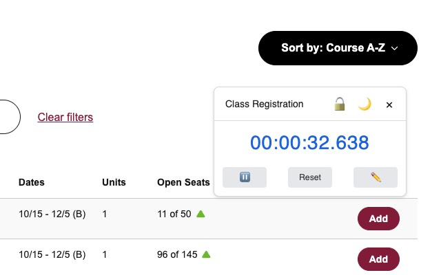

# Floating Countdown Timer

A Chrome extension that displays a floating countdown timer with millisecond precision, designed specifically for tracking time-sensitive events like registrations, ticket sales, or online classes.

## Key Features

- **Floating Widget:** Displays a draggable countdown timer on any webpage.
- **Millisecond Precision:** Shows remaining time down to the millisecond (`HH:MM:SS.ms`).
- **Customizable Target Time:** Set your target date and time easily via the options page or inline controls.
- **Event Naming:** Assign a name to your countdown event.
- **Light/Dark Themes:** Switch between themes for better visibility.
- **Position Saving:** Remembers the timer's position on the screen.
- **Position Lock:** Lock the timer in place to prevent accidental dragging.
- **End Notification:** Sends a system notification when the countdown reaches zero.

## Installation

### 1. From Chrome Web Store (Recommended)

- Install the extension from the Chrome Web Store.

### 2. From Source (For Development)

1.  Clone this repository or download the source code as a ZIP file.
2.  Open Chrome and navigate to `chrome://extensions/`.
3.  Enable "Developer mode" using the toggle switch in the top-right corner.
4.  Click the "Load unpacked" button.
5.  Select the directory containing the extension's source code (the folder with `manifest.json`).

## Usage

1.  **Set Timer:**
    - Click the extension icon in your toolbar and navigate to the **Options** page (or right-click the icon -> Options).
    - Enter an optional Event Name and select the target Date and Time.
    - Click "Save Settings".
    - Alternatively, if the timer widget is visible, click the **Edit** (✏️) icon on the widget itself to open inline settings, set the time/name, and save.
2.  **View Timer:**
    - Click the extension icon in your toolbar to toggle the floating timer's visibility on the current page.
3.  **Interact with Timer:**
    - **Drag:** Click and drag the header (when unlocked) to move the timer.
    - **Lock/Unlock:** Click the **Lock** (🔒/🔓) icon to fix/unfix the position.
    - **Theme:** Click the **Theme** (🌙/☀️) icon to toggle light/dark mode.
    - **Pause/Resume:** Click the **Pause** (⏸️/▶️) icon.
    - **Reset:** Click the **Reset** button to clear the current timer.
    - **Edit:** Click the **Edit** (✏️) icon to change the current timer's settings.
    - **Close:** Click the **Close** (✖️) icon to hide the timer on the current page.
